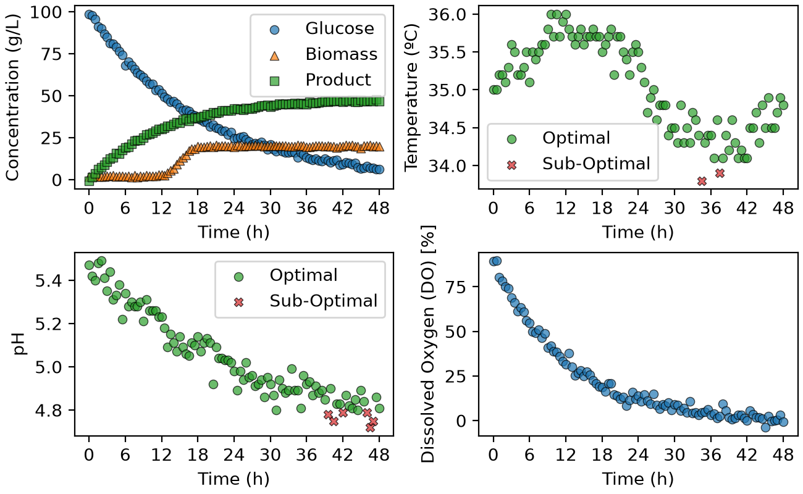

# Monitoring of fermentation processes
A python project that generates dashboards and summary tables from fermentation processes data, allowing the analysis 
of variables such as pH, temperature and concentration.

## Overview
The main objective of this project is to analyze various changes in fermentation measurements over a defined period 
of time, including changes in temperature and pH. In fact, the temperature and the pH of fives batches are monitored 
to assess if they fall within specified ranges.

## Features
The `BioprocessMonitor` class does a few things:
* Extracts fermentation data from a CSV file
* Selects data for individual batches
* Counts the total number of batches
* Uses masks to identify batches with optimal pH and temperature measurements
* Creates and saves dashboards showing concentrations, temperatures, pH and dissolved oxygen versus time for each batch
* Exports a CSV summary table showing each batch's percentage of acceptable pH and temperature measurements,and its final 
product concentration

## Technologies used
Here are the technologies used to code this project:
* Python 3.14.7
* NumPy 2.5.2 for arrays operations and masks calculations
* pandas 3.0.5 to load CSV files, extract batch measurements and exporting summary tables
* Matplotlib 3.11.0 to create, format and save the dashboards
* os (Python standard library) to construct file paths

## Code Design
Running `main.py` analyzes the fermentation data using two sets of limits: modes A and B.
For mode A, the optimal pH range is 4.8-5.6 and the optimal temperature range is 34.0-36 C.
For mode B, the optimal pH range is 5.1-5.5 and the optimal temperature range is 34.5-35.5 C.

The main script creates a BioprocessMonitor object for each mode, which loads the fermentation data and stores
the corresponding limits. Now, the script can start looping through all five batches. It selects each batch's 
measurements, identifies acceptable pH and temperatures values using masks and saves a dashboard in the
`figures/` folder.

The script also exports a summary table for each mode to the `tables` folder. As previously mentioned, the table 
indicates each batch's percentage of acceptable pH and temperature measurements as well as the batch's final 
product concentration. In total, the script generates ten dashboards and two summary tables.

## Dashboard
Here is an example of a dashboard generated by my project:

This dashboard displays four scatter plots for batch 1 on mode A:
* The top-left plot shows the glucose, biomass and product concentrations versus time, with different markers for each substance.
* The top-right plot shows the temperature versus time, with different markers for optimal versus sub-optimal temperature measurements.
* The bottom-left plot show the pH versus time, with different markers for optimal versus sub-optimal pH measurements.
* The bottom-right plot shows the dissolved oxygen percentage versus time.

## Summary table
Here is an example of a summary table generated by my project:

|batch_id|pH_optimal_percent|temperature_optimal_percent|C_product_g_L^-1_final|
|--------|------------------|---------------------------|----------------------|
|1       |36.08             |51.55                      |46.5                  |
|2       |34.71             |55.37                      |50.8                  |
|3       |36.99             |46.58                      |44.6                  |
|4       |54.12             |62.35                      |48.6                  |
|5       |16.51             |49.54                      |24.7                  |

This table summarizes the five batches under mode B.

